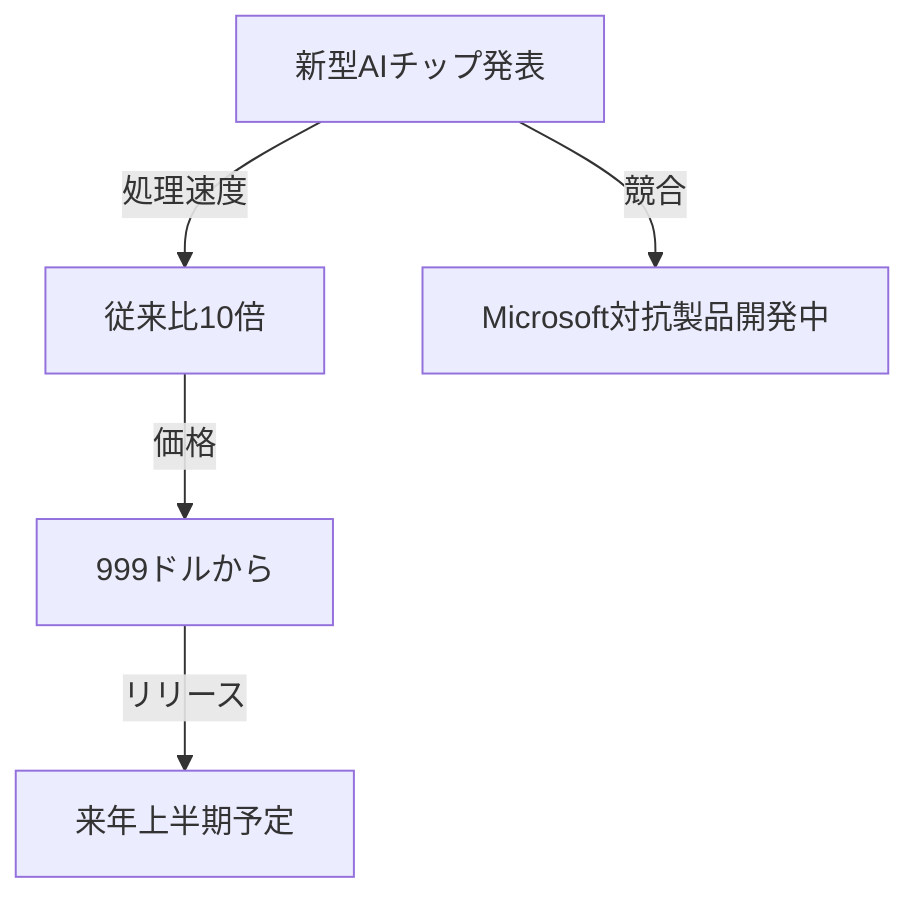
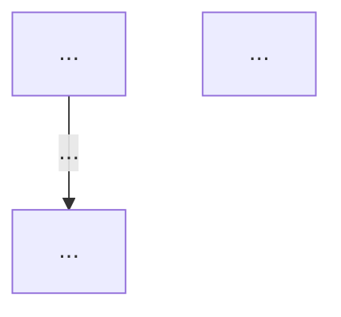

# Mermaid CLI エラーの解決ガイド

## 🔴 エラーメッセージ

```
mmdc (mermaid-cli) がインストールされていません。
「npm install -g @mermaid-js/mermaid-cli」を実行してください。
```

## ❓ なぜこのエラーが発生するのか？

Azure App Service は、セキュリティとリソース管理上の理由により、グローバル npm パッケージの自動インストールをサポートしていません。

- ❌ Azure 環境では `mmdc` コマンドが利用できない
- ❌ `npm install -g` でのインストールは通常は失敗
- ✅ ローカル環境では正常に動作

---

## ✅ 解決方法（3パターン）

### パターン 1: ローカル環境で実行（推奨度 ⭐⭐⭐）

**最も簡単で確実な方法です。**

ローカル開発環境でアプリを実行すれば、Mermaid 図解が正常に PNG に変換されます。

#### 実行手順

```bash
# 1. プロジェクトディレクトリに移動
cd ~/Desktop/news-summarizer-p

# 2. 仮想環境をアクティベート
source .venv/bin/activate

# 3. ローカルで起動
python main.py

# 出力例:
#  * Serving Flask app 'main'
#  * Debug mode: on
#  * Running on http://127.0.0.1:5000
```

#### ブラウザでアクセス

1. `http://localhost:5000` を開く
2. ニュース本文を入力 → 「要約する」
3. 「図をPNGで保存」ボタンをクリック
4. ✅ PNG ファイルがダウンロード可能

#### メリット

- 🟢 確実に動作
- 🟢 追加インストール不要
- 🟢 デバッグが容易
- 🟢 オフラインで利用可能

#### デメリット

- ⚠️ ローカル環境が必要

---

### パターン 2: Mermaid Live Editor を使用（推奨度 ⭐⭐⭐⭐）

**オンラインツールを使用する最も実用的な方法です。**

Azure App Service でアプリを実行しつつ、図解はオンラインツールで処理します。

#### 実行手順

**Step 1: Azure Web App でアプリを起動**
```
https://[your-app-name].azurewebsites.net/
```

**Step 2: ニュース要約を生成**
- テキストを入力 → 「要約する」ボタンをクリック
- 要約結果に Mermaid コードが含まれます

**Step 3: 図解ボタンをクリック**
- 「図をPNGで保存」をクリック
- エラーメッセージが表示されます

**Step 4: Mermaid Live Editor にアクセス**

エラーメッセージ内のリンク、または以下にアクセス：
```
https://mermaid.live/
```

**Step 5: コードをペースト**
- 要約結果から Mermaid コードをコピー
- エディタにペースト
- 図が自動的にレンダリング

**Step 6: PNG をダウンロード**
- 画面右側の **Download** ボタンをクリック
- PNG ファイルが保存されます

#### サンプル Mermaid コード



#### メリット

- 🟢 Azure アプリと同時に利用可能
- 🟢 インストール不要
- 🟢 編集機能が充実
- 🟢 複数形式でエクスポート可能（PNG, SVG など）
- 🟢 URLで図を共有可能

#### デメリット

- ⚠️ インターネット接続が必要
- ⚠️ 手動で Mermaid コードをコピペが必要

---

### パターン 3: Azure に npm をインストール（推奨度 ⭐）

**上級向けの方法です。**

Azure App Service 内に npm をインストールすることで、mmdc を使用可能にできます。

#### 前提条件

- Azure Kudu コンソールへのアクセス権
- App Service が **Standard 以上** のプラン（Free では不可）

#### 実行手順

**Step 1: Kudu コンソールにアクセス**

```
https://[app-name].scm.azurewebsites.net/DebugConsole
```

**Step 2: npm をインストール**

```bash
npm install -g @mermaid-js/mermaid-cli
```

**Step 3: インストール確認**

```bash
mmdc --version
# mermaid-cli 10.6.1
```

**Step 4: App Service を再起動**

Azure Portal から再起動するか：

```bash
az webapp restart --resource-group news-summarizer-rg --name news-summarizer-app
```

#### メリット

- 🟢 Azure 上で完全に動作
- 🟢 ユーザーにとって透過的

#### デメリット

- ⚠️ 複雑な設定が必要
- ⚠️ 容量制限に達する可能性（Azure Free では不可）
- ⚠️ 起動時間が増加
- ⚠️ パフォーマンス低下の可能性
- ⚠️ メンテナンスが複雑

---

## 🎯 推奨フロー図

```
┌─────────────────────────────┐
│ Azure Web App でニュース要約 │
└──────────────┬──────────────┘
               │
        ┌──────▼──────┐
        │ Mermaid図生成 │
        └──────┬──────┘
               │
        ┌──────▼──────┐
        │ PNG変換が必要 │
        └──────┬──────┘
               │
    ┌──────────┼──────────┐
    │          │          │
  【推奨】  【推奨】   【上級】
    │          │          │
    ↓          ↓          ↓
┌────────┐ ┌─────────────────┐ ┌──────┐
│ローカル │ │Mermaid Live Ed. │ │npm   │
│実行    │ │                 │ │install│
└────────┘ └─────────────────┘ └──────┘
    │          │          │
    └──────────┼──────────┘
               │
         ┌─────▼─────┐
         │ PNG保存    │
         └───────────┘
```

---

## 🧪 確認方法

### Azure 環境での動作確認

```bash
# ログを確認してエラーを追跡
az webapp log tail --resource-group news-summarizer-rg --name news-summarizer-app

# 出力例:
# INFO: mmdc コマンドが見つかりません - ローカル環境での利用を推奨
```

### ローカル環境での動作確認

```bash
# mmdc が正常にインストールされているか確認
mmdc --version

# 手動で Mermaid → PNG に変換
mmdc -i diagram.mmd -o diagram.png -s 2
```

---

## 📋 トラブルシューティングチェックリスト

Mermaid 図解が動作しない場合、以下を確認してください：

- [ ] **ローカル環境で mmdc は動作するか？**
  ```bash
  mmdc --version
  ```

- [ ] **npm は正常にインストールされているか？**
  ```bash
  npm --version
  ```

- [ ] **Mermaid Live Editor にアクセスできるか？**
  ```
  https://mermaid.live/
  ```

- [ ] **要約結果に Mermaid コードが含まれているか？**
  ```
  ```mermaid
  ... コード ...
  ```
  ```

- [ ] **Azure App Service のログにエラーがないか？**

---

## 💡 Tips

### Mermaid コードをコピーしやすくする

要約結果からコード部分を選択してコピー：

```markdown
# 要約タイトル

...


```

このコード部分をコピーして Mermaid Live Editor にペースト

### 複数の図を効率的に処理

要約に複数の Mermaid 図が含まれる場合：

1. 各図を個別にコピー
2. Mermaid Live Editor で変換
3. 複数の PNG を保存

---

## 🔗 参考リンク

- **Mermaid Live Editor**: https://mermaid.live/
- **Mermaid ドキュメント**: https://mermaid.js.org/
- **Azure App Service**: https://learn.microsoft.com/en-us/azure/app-service/
- **npm 公式サイト**: https://www.npmjs.com/

---

## ❓ よくある質問

**Q: なぜ Azure では mmdc が動作しないのか？**
A: セキュリティとリソース管理上の理由により、Azure App Service はグローバル npm パッケージの実行を制限しています。

**Q: Mermaid Live Editor は安全か？**
A: はい。Mermaid Live Editor は公式ツールで、データは暗号化されています。

**Q: オフラインでも動作するか？**
A: ローカル環境で実行すれば、オフラインで完全に動作します。

**Q: 他の PNG 変換方法はあるか？**
A: SVG を使用するか、別の図表ツール（PlantUML など）の使用も検討できます。

