# Mermaid CLI Error Troubleshooting Guide

## 🔴 Error Message

```
mmdc (mermaid-cli) is not installed.
Please run: npm install -g @mermaid-js/mermaid-cli
```

## ❓ Why this happens

Azure App Service does not support automatically installing global npm packages for security and resource-management reasons.

- ❌ The `mmdc` command is unavailable in the default Azure environment
- ❌ `npm install -g` normally fails on App Service
- ✅ Local environments work without any issue

---

## ✅ Three Ways to Resolve the Issue

### Option 1: Run locally (recommended ⭐⭐⭐)

**Easiest and most reliable.**

Run the application on your local machine and Mermaid diagrams convert to PNG without errors.

```bash
# 1. Move into the project directory
cd ~/Desktop/news-summarizer-p

# 2. Activate the virtual environment
source .venv/bin/activate

# 3. Start the app locally
python main.py

# Sample output:
#  * Serving Flask app 'main'
#  * Debug mode: on
#  * Running on http://127.0.0.1:5000
```

**Browser flow**
1. Open `http://localhost:5000`
2. Paste the news article → click **Summarize**
3. Click **Save diagram as PNG**
4. ✅ PNG file downloads successfully

**Pros**
- 🟢 Guaranteed to work
- 🟢 No extra installs on Azure
- 🟢 Easy to debug
- 🟢 Works offline

**Cons**
- ⚠️ Requires a local environment

---

### Option 2: Use Mermaid Live Editor (recommended ⭐⭐⭐⭐)

**Most practical online workaround.**

Keep the app running on Azure App Service, but offload diagram rendering to the official Mermaid Live Editor.

1. **Open your Web App**
   ```
   https://[your-app-name].azurewebsites.net/
   ```
2. **Generate a summary**
   - Paste article text → click **Summarize**
   - The response includes Mermaid code blocks
3. **Click the diagram button**
   - Click **Save diagram as PNG**
   - An error message appears (expected)
4. **Open Mermaid Live Editor**
   ```
   https://mermaid.live/
   ```
5. **Paste the code**
   - Copy the Mermaid block from the summary
   - Paste into the editor
   - The diagram renders automatically
6. **Download the PNG**
   - Click **Download** on the right pane
   - PNG saves to your device

**Sample Mermaid code**

```mermaid
graph TD
    A[New AI chip announced] -->|Performance| B[10× faster than previous]
    B -->|Price| C[Starting at $999]
    C -->|Release| D[Ships in H1 next year]
    A -->|Competition| E[Microsoft rival product in development]
```



**Pros**
- 🟢 Works alongside the Azure-hosted app
- 🟢 No installation required
- 🟢 Powerful editing tools
- 🟢 Export as PNG/SVG, share via URL

**Cons**
- ⚠️ Needs an internet connection
- ⚠️ Requires manual copy/paste

---

### Option 3: Install npm inside Azure (advanced ⭐)

**For advanced users only.**

Install npm/mermaid-cli inside Azure App Service via Kudu so `mmdc` becomes available.

**Prerequisites**
- Access to the Azure Kudu console
- App Service plan must be **Standard tier or higher** (Free tier lacks storage)

**Steps**
1. Open Kudu:
   ```
   https://[app-name].scm.azurewebsites.net/DebugConsole
   ```
2. Install mermaid-cli:
   ```bash
   npm install -g @mermaid-js/mermaid-cli
   ```
3. Verify installation:
   ```bash
   mmdc --version
   # mermaid-cli 10.6.1
   ```
4. Restart the App Service (Portal or CLI):
   ```bash
   az webapp restart --resource-group news-summarizer-rg --name news-summarizer-app
   ```

**Pros**
- 🟢 Everything runs directly on Azure
- 🟢 Transparent to end users

**Cons**
- ⚠️ Setup is more complex
- ⚠️ Storage limits (Free tier cannot handle it)
- ⚠️ Longer cold-start times
- ⚠️ Potential performance drop
- ⚠️ Ongoing maintenance burden

---

## 🎯 Recommended Flow (diagram)

```
┌─────────────────────────────┐
│ Summarize news on Azure Web │
└──────────────┬──────────────┘
               │
        ┌──────▼──────┐
        │ Generate Mermaid │
        └──────┬──────┘
               │
        ┌──────▼──────┐
        │ Need PNG export │
        └──────┬──────┘
               │
    ┌──────────┼──────────┐
    │          │          │
 [Recommended][Recommended][Advanced]
    │          │          │
    ↓          ↓          ↓
┌────────┐ ┌─────────────────┐ ┌──────┐
│ Local  │ │ Mermaid Live Ed. │ │ npm  │
│ run    │ │                 │ │install│
└────────┘ └─────────────────┘ └──────┘
    │          │          │
    └──────────┼──────────┘
               │
         ┌─────▼─────┐
         │ Save PNG  │
         └───────────┘
```

---

## 🧪 Validation Steps

### On Azure

```bash
# Stream logs to inspect errors
az webapp log tail --resource-group news-summarizer-rg --name news-summarizer-app

# Example:
# INFO: mmdc command not found - please use local environment
```

### Locally

```bash
# Confirm mmdc is installed
mmdc --version

# Manually convert Mermaid → PNG
mmdc -i diagram.mmd -o diagram.png -s 2
```

---

## 📋 Troubleshooting Checklist

If Mermaid exports fail, verify the following:

- [ ] **Does `mmdc` work locally?**
  ```bash
  mmdc --version
  ```
- [ ] **Is npm installed correctly?**
  ```bash
  npm --version
  ```
- [ ] **Can you open Mermaid Live Editor?**
  ```
  https://mermaid.live/
  ```
- [ ] **Does the summary contain Mermaid code blocks?**
  ```markdown
  ```mermaid
  ... code ...
  ```
  ```
- [ ] **Do Azure App Service logs show any errors?**

---

## 💡 Tips

### Copy Mermaid blocks quickly

Select only the code fence in the summary:

```markdown
# Summary Title

...


```

Paste that block directly into Mermaid Live Editor.

### Handle multiple diagrams efficiently

1. Copy each block individually
2. Paste into Mermaid Live Editor
3. Download each PNG

---

## 🔗 Helpful links

- **Mermaid Live Editor**: https://mermaid.live/
- **Mermaid documentation**: https://mermaid.js.org/
- **Azure App Service**: https://learn.microsoft.com/en-us/azure/app-service/
- **npm official site**: https://www.npmjs.com/

---

## ❓ FAQ

**Q: Why can’t Azure run `mmdc` out of the box?**  
A: App Service restricts global npm packages for security/resource reasons.

**Q: Is Mermaid Live Editor safe?**  
A: Yes. It is the official tool and uses encrypted connections.

**Q: Can I work offline?**  
A: Yes—run the app locally and install mermaid-cli on your machine.

**Q: Are there other PNG conversion options?**  
A: You can export SVG instead or use alternative tooling like PlantUML.
