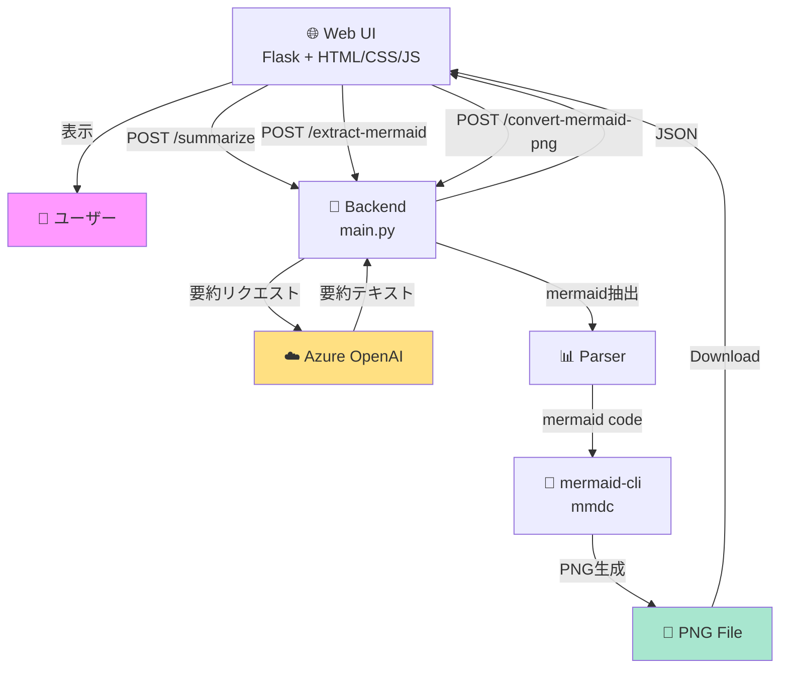

# 📰 News Summarizer P

ニュース記事やテキストを受け取り、要約と図解を生成するアプリケーションです。**Azure OpenAI** を使用した自動要約機能と、**Mermaid** による図解生成、そして **PNG形式でのダウンロード** に対応しています。

## ✨ 主な機能

### 1. **要約生成**
- Azure OpenAI API を使用した高精度な要約
- Markdown 形式での出力
- 要点、詳細、図解を含む構造化された要約

### 2. **図解生成（新機能）**
- 記事内容を **Mermaid** で図解
- 複数図解に対応
- 図解を個別に **PNG形式で保存**

### 3. **Markdownダウンロード**
- 要約全体を Markdown ファイルで保存
- オフライン利用可能

### 4. **Azure クラウドデプロイ**
- **低価格プラン** での構成
- Key Vault によるシークレット管理
- App Service での自動ホスティング

## 🏗️ アーキテクチャ



## 📁 プロジェクト構成

```
news-summarizer-p/
├── main.py                          # Flask アプリケーションのエントリポイント
├── templates/
│   └── index.html                   # Web UI（要約、ダウンロード機能）
├── .env                             # 環境変数（ローカル開発用）
├── pyproject.toml                   # Python プロジェクト設定
├── requirements.txt                 # 依存パッケージ
│
├── terraform/                       # Azure インフラストラクチャ定義
│   ├── main.tf                      # リソース定義
│   ├── variables.tf                 # 変数定義
│   ├── env.tf                       # .env から Terraform への統合
│   ├── outputs.tf                   # 出力情報
│   ├── terraform.tfvars             # 設定値
│   ├── secret.tfvars.example        # 秘密変数テンプレート
│   └── secret.tfvars                # 秘密情報（自動生成、Git除外）
│
├── scripts/                         # ユーティリティスクリプト
│   ├── env_to_tfvars.py            # .env → secret.tfvars 変換（Python）
│   ├── env_to_tfvars.sh            # .env → secret.tfvars 変換（Bash）
│   └── env_to_tfvars.ps1           # .env → secret.tfvars 変換（PowerShell）
│
├── DEPLOYMENT.md                    # Azure デプロイメントガイド
├── ENV_TO_TERRAFORM.md              # .env と Terraform の統合ガイド
├── QUICKSTART_ENV_TERRAFORM.md      # クイックスタート
└── README.md                        # このファイル
```

## 🚀 クイックスタート

### ローカル開発

#### 1. セットアップ

```bash
# リポジトリをクローン
git clone <repository-url>
cd news-summarizer-p

# 仮想環境を作成・有効化
uv venv
source .venv/bin/activate  # Mac/Linux
# または
.venv\Scripts\activate  # Windows

# 依存パッケージをインストール
uv pip install -r requirements.txt
```

#### 2. 環境変数を設定

```bash
# .env ファイルを確認（既に存在）
cat .env

# 出力例:
# ENDPOINT=https://poti1-mi8uf9zs-eastus2.cognitiveservices.azure.com/
# MODEL_NAME=gpt-5.1-chat
# SUBSCRIPTION_KEY=7DgN2tQz...
# API_VERSION=2024-12-01-preview
```

#### 3. Mermaid CLI をインストール（図解機能を使う場合）

```bash
# Node.js が必要
npm install -g @mermaid-js/mermaid-cli
```

#### 4. アプリケーションを起動

```bash
uv run main.py
```

ブラウザで `http://localhost:5000` にアクセス

### Azure へのデプロイ

詳細は [DEPLOYMENT.md](DEPLOYMENT.md) を参照してください。

#### 1. 秘密情報を生成

```bash
# .env から secret.tfvars を自動生成
uv run scripts/env_to_tfvars.py
```

#### 2. Terraform でデプロイ

```bash
cd terraform
terraform init
terraform plan -var-file="secret.tfvars"
terraform apply -var-file="secret.tfvars"
```

詳細は [QUICKSTART_ENV_TERRAFORM.md](QUICKSTART_ENV_TERRAFORM.md) を参照。

## 📊 機能デモ

### 1. 要約生成
1. ニュース本文をテキストエリアに貼り付け
2. 「要約する」ボタンをクリック
3. Markdown 形式の要約が表示

**出力例:**
```markdown
# 記事タイトル

## 要点
- 要点1
- 要点2

## 詳細
段落形式の要約...

## 図解
（Mermaid の図）
```

### 2. 複数図解のダウンロード（新機能）
1. 「図をPNGで保存」ボタンを表示（複数図がある場合）
2. ボタンクリック → 図解選択メニューが展開
3. 「図解 1 をダウンロード」などで PNG 保存

### 3. Markdown ダウンロード
1. 「Markdownをダウンロード」ボタンをクリック
2. `news_summary.md` ファイルをダウンロード

## 🛠️ 環境構成

### ローカル開発環境
- **Flask** - Web フレームワーク
- **LangChain** - LLM チェーン管理
- **Azure OpenAI** - 要約エンジン
- **Mermaid CLI** - 図解変換（PNG）
- **dotenv** - 環境変数管理

### クラウド環境（Azure）
- **App Service** (Free/F1) - Web アプリケーション
- **Container Registry** (Basic) - イメージ管理
- **Key Vault** - シークレット管理
- **Storage Account** - ログ保存

## 📚 ドキュメント

| ドキュメント | 説明 |
|-----------|------|
| [DEPLOYMENT.md](DEPLOYMENT.md) | Azure へのデプロイメント完全ガイド |
| [ENV_TO_TERRAFORM.md](ENV_TO_TERRAFORM.md) | .env と Terraform 統合の詳細ガイド |
| [QUICKSTART_ENV_TERRAFORM.md](QUICKSTART_ENV_TERRAFORM.md) | 30秒で開始できるクイックスタート |

## 🔐 セキュリティ

- API キーは **.env** に保存（Git 除外）
- デプロイ時は **Key Vault** で管理
- マネージド ID で App Service → Key Vault の認証
- 秘密情報は環境変数で参照

**重要:**
```bash
# これらは Git にコミットしない
.env
terraform/secret.tfvars
```

## 💰 Azure コスト

### 月額予想

| サービス | プラン | 月額 |
|---------|--------|------|
| App Service | F1 (Free) | **無料** |
| Container Registry | Basic | ¥2,500 |
| Key Vault | Standard | ¥700 |
| Storage | LRS | 従量課金 |
| **合計** | | **約¥3,200+** |

### コスト削減のヒント
- 非使用時は App Service を停止
- ログ保持期間を短縮
- ストレージをクリーンアップ

## 🐛 トラブルシューティング

### Mermaid CLI エラー

```bash
# mmdc が見つからない場合
npm install -g @mermaid-js/mermaid-cli

# または、Docker で実行（オプション）
# docker run --rm -v $(pwd):/data minlag/mermaid-cli ...
```

### Azure デプロイエラー

```bash
# ログを確認
az webapp log tail --resource-group summary-func-rg --name summary-app-001

# 環境変数を確認
az webapp config appsettings list \
  --resource-group summary-func-rg \
  --name summary-app-001
```

詳細は [DEPLOYMENT.md](DEPLOYMENT.md#トラブルシューティング) を参照。

## 🎯 次のステップ

- [ ] ユニットテストを追加
- [ ] GitHub Actions でのこち自動デプロイを設定
- [ ] Application Insights で監視を有効化
- [ ] カスタムドメインを設定
- [ ] SSL/TLS 証明書を設定

## 📝 ライセンス

MIT License

## 👥 サポート

質問や問題がある場合は、以下のドキュメントを参照してください：

- ローカル実行: [README.md](#クイックスタート)
- Azure デプロイ: [DEPLOYMENT.md](DEPLOYMENT.md)
- .env 統合: [ENV_TO_TERRAFORM.md](ENV_TO_TERRAFORM.md)

---

**最終更新**: 2025年11月22日
**バージョン**: 1.0.0
