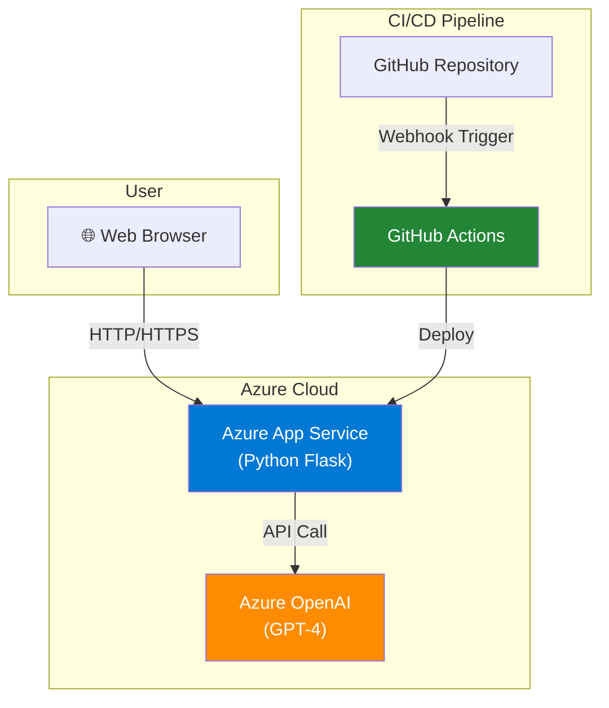
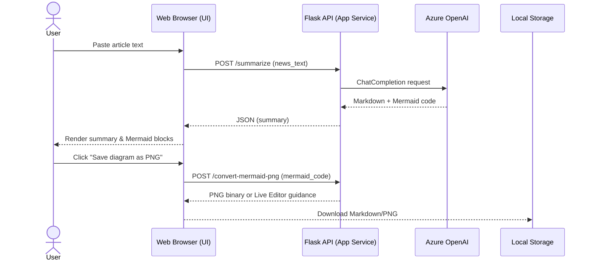

# 📰 News Summarizer P

**An LLM-powered intelligent article summarization platform.** Enterprise-grade application featuring Azure OpenAI for precise summaries, automatic Mermaid diagrams, and continuous deployment to Azure App Service.

## ✨ Key Features

| Feature | Details |
|---------|---------|
| **Automated Summaries** | Structured summaries powered by Azure OpenAI (GPT-4 family) including highlights, deep dives, and diagrams |
| **Auto Diagramming** | Mermaid flowcharts/diagrams extracted directly from article context |
| **PNG Export** | Save each diagram as a high-quality PNG—including multi-diagram responses |
| **Markdown Output** | Download the entire summary bundle as structured Markdown |
| **Continuous Deployment** | GitHub Actions + Azure App Service pipeline for hands-free releases |

## 🏗️ Architecture



## 📡 Data Flow



## 🚀 Quick Start

### Local Development (≈5 min)

```bash
# 1. Clone the repo
git clone <repository-url>
cd news-summarizer-p

# 2. Set up Python environment (Python 3.10+)
# Recommended: use uv for env + deps
uv venv .venv
source .venv/bin/activate  # macOS/Linux
# or
.venv\Scripts\activate  # Windows

# Not using uv?
# python3 -m venv .venv && source .venv/bin/activate

# 3. Install dependencies
# Official flow: sync with uv lockfile
uv pip sync

# Prefer pip?
# pip install -r requirements.txt

# 4. Install Mermaid CLI for PNG export
npm install -g @mermaid-js/mermaid-cli

# 5. Configure environment variables
# Populate .env with Azure OpenAI credentials:
# - ENDPOINT: Azure OpenAI endpoint
# - SUBSCRIPTION_KEY: API key
# - MODEL_NAME: deployed model name
# - API_VERSION: API version
cat <<'EOT' > .env
ENDPOINT="https://your-resource.openai.azure.com/"
SUBSCRIPTION_KEY="your-api-key"
MODEL_NAME="gpt-4o-mini"
API_VERSION="2024-02-15-preview"
DEVELOPMENT=true
FLASK_ENV=development
EOT

# 6. Run the application
python main.py

# Open http://localhost:5000
```

> ℹ️ **uv as the default toolchain**: Local development uses [Astral uv](https://github.com/astral-sh/uv) for consistent environment & dependency management. Because `uv.lock` mirrors production, running `uv pip sync` reproduces exact versions (use `requirements.txt` if you prefer pip).

> ℹ️ **`mmdc` is unavailable on Azure App Service**, so `/convert-mermaid-png` returns 501 (Not Implemented). Convert diagrams locally or via browser-based Mermaid Live Editor. See `MERMAID_ERROR_SOLUTION.md` for fallback options.

## ⚙️ Environment Variables

| Name | Required | Description |
|------|----------|-------------|
| `ENDPOINT` | ✅ | Azure OpenAI endpoint URL, e.g. `https://xxx.openai.azure.com/` |
| `SUBSCRIPTION_KEY` | ✅ | Azure OpenAI API key |
| `MODEL_NAME` | ✅ | Deployed model name (e.g. `gpt-4o-mini`) |
| `API_VERSION` | ✅ | API version to call (e.g. `2024-02-15-preview`) |
| `DEVELOPMENT` | Optional | Local debugging flag; `true` aligns Flask behavior with local defaults |
| `FLASK_ENV` | Optional | Flask mode; `development` enables hot reload |
| `PORT` | Optional | Local server port (default `5000`) |

### Deploy to Azure (GitHub Actions × App Service)

#### Step 1: Provision Azure Infrastructure

```bash
# Log in to Azure
az login

# Create resource group
az group create \
  --name news-summarizer-rg \
  --location eastus

# Create App Service plan
az appservice plan create \
  --name news-summarizer-plan \
  --resource-group news-summarizer-rg \
  --sku F1 --is-linux

# Create Web App
az webapp create \
  --resource-group news-summarizer-rg \
  --plan news-summarizer-plan \
  --name news-summarizer-app \
  --runtime "PYTHON:3.11"

# Configure environment variables
az webapp config appsettings set \
  --resource-group news-summarizer-rg \
  --name news-summarizer-app \
  --settings \
    ENDPOINT="https://your-resource.openai.azure.com/" \
    SUBSCRIPTION_KEY="your-api-key" \
    MODEL_NAME="gpt-4" \
    API_VERSION="2024-02-15-preview"
```

#### Step 2: Set Up GitHub Actions

Create `.github/workflows/deploy.yaml`:

```yaml
name: Deploy to Azure App Service

on:
  push:
    branches: [ main ]

jobs:
  build-and-deploy:
    runs-on: ubuntu-latest
    steps:
      - uses: actions/checkout@v3

      - name: Set up Python
        uses: actions/setup-python@v4
        with:
          python-version: '3.11'

      - name: Install dependencies
        run: |
          python -m pip install --upgrade pip
          pip install -r requirements.txt

      - name: Deploy to Azure App Service
        uses: azure/webapps-deploy@v2
        with:
          app-name: news-summarizer-app
          publish-profile: ${{ secrets.AZURE_WEBAPP_PUBLISH_PROFILE }}
          package: .
```

#### Step 3: Configure GitHub Secrets

```bash
# Download Publish Profile from Azure Portal
# App Service → Deployment Center → Get publish profile
# GitHub Repo → Settings → Secrets and variables → Actions
# Add as AZURE_WEBAPP_PUBLISH_PROFILE
```

All pushes to `main` now deploy automatically.

## 📁 Project Structure

```
news-summarizer-p/
├── main.py                    # Flask main entrypoint
├── app.py                     # Lightweight WSGI entry for App Service
├── wsgi.py                    # WSGI loader for Gunicorn
├── startup.sh                 # Custom start script (App Service)
├── requirements.txt           # pip dependency spec
├── pyproject.toml             # Project metadata
├── uv.lock                    # uv lockfile
├── static/
│   ├── main.js                # Front-end JavaScript
│   ├── styles.css             # Stylesheet
│   └── unsplash.jpg           # Hero image
├── templates/
│   └── index.html             # HTML template
├── .github/workflows/
│   └── deploy.yaml            # GitHub Actions workflow
├── AZURE_SETUP.md             # Azure provisioning guide
├── FIX_AZURE_DEPLOYMENT.md    # Deployment troubleshooting
├── MERMAID_ERROR_SOLUTION.md  # Mermaid fallback tips
├── premium_article_full_guide.md  # Comprehensive how-to guide
├── web.config                 # Windows/IIS config
└── README.md                  # This file
```

## 🛠️ API Endpoints

| Method | Endpoint | Purpose | Payload |
|--------|----------|---------|---------|
| POST | `/summarize` | Generate news summary | `{ "news_text": "..." }` |
| POST | `/extract-mermaid` | Extract Mermaid diagrams | `{ "summary": "..." }` |
| POST | `/convert-mermaid-png` | Convert Mermaid to PNG | `{ "mermaid_code": "...", "diagram_index": 0 }` |
| POST | `/download` | Download summary as Markdown | `{ "summary": "..." }` |

## 🔐 Security

### Local Development
- Store API keys in `.env` (ignored by Git)
- Never ship `.env` to production

### Azure Production
- Use App Service Application Settings for secrets
- Enforce HTTPS (default in App Service)
- Enable access control & audit logs

### Managing Secrets
```bash
# Configure App Service settings
az webapp config appsettings set \
  --resource-group <rg-name> \
  --name <app-name> \
  --settings \
    ENDPOINT="https://your-resource.openai.azure.com/" \
    SUBSCRIPTION_KEY="your-api-key" \
    MODEL_NAME="gpt-4" \
    API_VERSION="2024-02-15-preview"
```

## 📊 Feature Breakdown

### 1. Summary Engine

Automatically outputs:
- **Headline extraction** – core insight in a single line
- **Bulleted key points** – 3–5 highlights
- **Detailed recap** – paragraph-level deep dive
- **Mermaid diagrams** – flow/relationship visualization

### 2. Diagram Pipeline

```
Detect Mermaid code → Convert to PNG → Offer download
```

Supports multi-diagram responses with per-diagram downloads.

### 3. Continuous Deployment

```
Code push (main) → GitHub Actions → Build/test
  → Deploy → Azure App Service live update
```

## 📦 System Requirements

### Local
- Python 3.10+
- Node.js 16+ (for diagram export)
- npm (to install Mermaid CLI)

### Azure App Service
- Python 3.11 runtime
- Memory: 1 GB+ recommended
- Storage: 100 MB+

## 💰 Azure Cost Estimate

| Service | SKU | Monthly Estimate |
|---------|-----|------------------|
| App Service | F1 (Free) | **¥0** |
| Azure OpenAI | Standard | ¥3,000–5,000 |
| **Total** | | **¥3,000–5,000** |

**Cost tips:**
- Start on App Service Free tier
- Upgrade to Standard when necessary
- Use autoscale to handle peaks efficiently

## 🐛 Troubleshooting

### Local

| Issue | Fix |
|-------|-----|
| `mmdc: command not found` | Run `npm install -g @mermaid-js/mermaid-cli` |
| Azure API errors | Re-check `.env` values for `ENDPOINT`, `SUBSCRIPTION_KEY`, `MODEL_NAME` |
| Flask won’t start | Ensure port 5000 is free: `lsof -i :5000` |

### Azure Deployment

```bash
# Stream App Service logs
az webapp log tail --resource-group news-summarizer-rg --name news-summarizer-app

# List environment variables
az webapp config appsettings list \
  --resource-group news-summarizer-rg \
  --name news-summarizer-app

# Restart the app
az webapp restart \
  --resource-group news-summarizer-rg \
  --name news-summarizer-app
```

## 🎯 Production Checklist

- [ ] **Enable monitoring** – connect Application Insights
- [ ] **SSL/TLS** – custom domain + HTTPS enforcement
- [ ] **Backups** – schedule App Service backups
- [ ] **Rate limiting** – protect against abuse/DDoS
- [ ] **Logging** – ingest metrics via Azure Monitor
- [ ] **Scaling strategy** – configure autoscale rules

## 📚 References

- [Azure App Service Docs](https://learn.microsoft.com/azure/app-service/)
- [GitHub Actions Documentation](https://docs.github.com/en/actions)
- [Azure OpenAI Service](https://learn.microsoft.com/azure/ai-services/openai/)
- [Mermaid Syntax](https://mermaid.js.org/intro/)

## 📝 License

MIT License

## 👨‍💻 Developer Notes

**Language:** Python 3.11+  
**Framework:** Flask  
**LLM:** Azure OpenAI (GPT-4 family)  
**Diagram Engine:** Mermaid + mermaid-cli  
**Deployment:** GitHub Actions × Azure App Service

---

**Last Updated:** Nov 24, 2025  
**Version:** 1.0.0  
**Maintainer:** Ken-kichi
