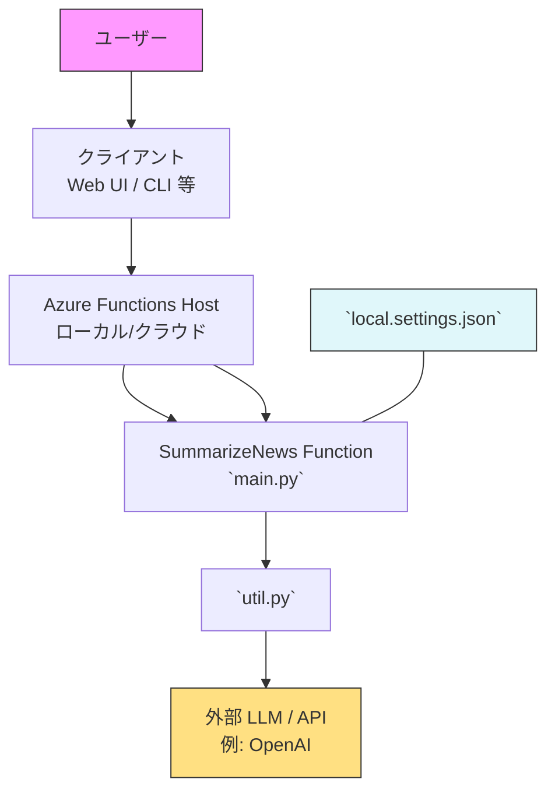

**プロジェクト説明**:
- **目的**: `news-summarizer-p` はニュース記事やテキストを受け取り、要約を生成する小さなプロジェクトです。Azure Functions（ローカルでも実行可能）を使った関数ベースの構成になっています。
- **主なファイル**: `main.py`, `util.py`, `SummarizeNews/__init__.py`, `SummarizeNews/function.json`, `local.settings.json`

**アーキテクチャ (Mermaid)**:
以下はアプリの主要なフローを示す Mermaid 図です。GitHub や一部のドキュメントツールは Mermaid をレンダリングできます。



**コンポーネント説明**:
- **`main.py`**: エントリポイント。HTTP トリガー（または CLI）からリクエストを受け取り、要約処理のワークフローを開始します。
- **`util.py`**: テキスト抽出、前処理、要約ロジック（外部 API 呼び出しや内部アルゴリズム）を収めるユーティリティ群です。
- **`SummarizeNews/__init__.py` / `SummarizeNews/function.json`**: Azure Functions の関数定義と設定。関数のバインディングやトリガー情報が入ります。
- **`local.settings.json`**: ローカル実行時の環境変数・シークレット（API キー等）を保持します（本番では安全なシークレット管理を使用してください）。

**ローカル実行（例）**:
事前準備: Python 3.x と仮想環境、必要なパッケージがあること。Azure Functions Core Tools を使う場合はインストールしてください。

```bash
# 仮想環境をアクティブにする（既に作成済みの場合）
source .venv/bin/activate

# (任意) requirements がある場合はインストール
uv pip install -r requirements.txt || true

# Azure Functions Core Tools がある場合は関数を起動
# func start

# シンプルに Python スクリプトを直接実行する場合（関数としてではない簡易実行）
uv run  main.py
```

**注意点 / 次の手順**:
- `local.settings.json` に API キーなどの秘密情報を入れる場合、リポジトリにコミットしないでください。
- 外部 LLM（例: OpenAI）を使う場合はレートやコスト管理、エラーハンドリングを実装してください。
- 追加で欲しい図（シーケンス図、詳細コンポーネント図）があれば教えてください。

# summary-func
