# 📰 News Summarizer P

**LLM駆動のインテリジェント記事要約プラットフォーム。** Azure OpenAI による高精度な要約生成、Mermaid による自動図解、そして Azure App Service への継続的デプロイに完全対応したエンタープライズグレードのアプリケーション。

## ✨ 主な機能

| 機能 | 詳細 |
|------|------|
| **自動要約生成** | Azure OpenAI (GPT-4) による構造化された要約。要点・詳細分析・自動図解を含む |
| **図解の自動生成** | 記事内容から Mermaid フローチャート/ダイアグラムを自動抽出・生成 |
| **PNG形式エクスポート** | 図解を高品質 PNG で個別保存。複数図解に対応 |
| **Markdown出力** | 要約全体を構造化 Markdown ファイルでダウンロード |
| **継続的デプロイ (CI/CD)** | GitHub Actions × Azure App Service による自動デプロイメント |

## 🏗️ アーキテクチャ

```mermaid
graph TB
    subgraph "ユーザーレイヤー"
        Browser["🌐 Web Browser"]
    end

    subgraph "Azure Cloud"
        AppService["Azure App Service<br/>(Python Flask)"]
        OpenAI["Azure OpenAI<br/>(GPT-4)"]
    end

    subgraph "CI/CD Pipeline"
        GitHub["GitHub Repository"]
        Actions["GitHub Actions"]
    end

    Browser -->|HTTP/HTTPS| AppService
    AppService -->|API Call| OpenAI
    GitHub -->|Webhook Trigger| Actions
    Actions -->|Deploy| AppService

    style AppService fill:#0078d4,color:#fff
    style OpenAI fill:#ff8c00,color:#fff
    style Actions fill:#238636,color:#fff
```



## 🚀 クイックスタート

### ローカル開発 (5分)

```bash
# 1. リポジトリをクローン
git clone <repository-url>
cd news-summarizer-p

# 2. Python 環境をセットアップ（Python 3.10+）
python3 -m venv .venv
source .venv/bin/activate  # macOS/Linux
# または
.venv\Scripts\activate  # Windows

# 3. 依存パッケージをインストール
pip install -r requirements.txt

# 4. 図解機能に必要な Mermaid CLI をインストール
npm install -g @mermaid-js/mermaid-cli

# 5. 環境変数を設定
# .env ファイルに Azure OpenAI の認証情報を記入:
# - ENDPOINT: Azure OpenAI のエンドポイント
# - SUBSCRIPTION_KEY: API キー
# - MODEL_NAME: デプロイされたモデル名
# - API_VERSION: API バージョン

# 6. アプリケーション起動
python main.py

# ブラウザで http://localhost:5000 にアクセス
```

### Azure へのデプロイ (GitHub Actions × App Service)

#### ステップ 1: Azure インフラをセットアップ

```bash
# Azure にログイン
az login

# リソースグループを作成
az group create \
  --name news-summarizer-rg \
  --location eastus

# App Service プランを作成
az appservice plan create \
  --name news-summarizer-plan \
  --resource-group news-summarizer-rg \
  --sku F1 --is-linux

# Web アプリを作成
az webapp create \
  --resource-group news-summarizer-rg \
  --plan news-summarizer-plan \
  --name news-summarizer-app \
  --runtime "PYTHON:3.11"

# App Service に環境変数を設定
az webapp config appsettings set \
  --resource-group news-summarizer-rg \
  --name news-summarizer-app \
  --settings \
    ENDPOINT="https://your-resource.openai.azure.com/" \
    SUBSCRIPTION_KEY="your-api-key" \
    MODEL_NAME="gpt-4" \
    API_VERSION="2024-02-15-preview"
```

#### ステップ 2: GitHub Actions で自動デプロイを設定

リポジトリに `.github/workflows/deploy.yml` を作成:

```yaml
name: Deploy to Azure App Service

on:
  push:
    branches: [ main ]

jobs:
  build-and-deploy:
    runs-on: ubuntu-latest
    steps:
      - uses: actions/checkout@v3

      - name: Set up Python
        uses: actions/setup-python@v4
        with:
          python-version: '3.11'

      - name: Install dependencies
        run: |
          python -m pip install --upgrade pip
          pip install -r requirements.txt

      - name: Deploy to Azure App Service
        uses: azure/webapps-deploy@v2
        with:
          app-name: news-summarizer-app
          publish-profile: ${{ secrets.AZURE_WEBAPP_PUBLISH_PROFILE }}
          package: .
```

#### ステップ 3: GitHub Secrets を設定

```bash
# Azure Portal で Publish Profile をダウンロード
# Settings → Deployment Center → Publish profile をコピー
# GitHub リポジトリの Settings → Secrets and variables → Actions
# に「AZURE_WEBAPP_PUBLISH_PROFILE」として追加
```

以降、`main` ブランチへの `push` で自動的にデプロイされます。

## 📁 ディレクトリ構成

```
news-summarizer-p/
├── main.py                    # Flask アプリケーション（エントリポイント）
├── static/
│   ├── main.js               # フロントエンド JavaScript
│   └── styles.css            # スタイルシート
├── templates/
│   └── index.html            # HTML テンプレート
├── pyproject.toml            # Python プロジェクト定義
├── requirements.txt          # Python 依存パッケージ
├── .env                      # 環境変数（ローカル開発用、Git除外）
├── .github/workflows/
│   └── deploy.yml           # GitHub Actions デプロイワークフロー
├── README.md                 # このファイル
└── Dockerfile               # コンテナイメージ定義（デプロイ用）
```

## 🛠️ API エンドポイント

| メソッド | エンドポイント | 説明 | リクエスト |
|---------|--------------|------|----------|
| POST | `/summarize` | ニュース記事を要約 | `{ "news_text": "..." }` |
| POST | `/extract-mermaid` | 要約から Mermaid 図解を抽出 | `{ "summary": "..." }` |
| POST | `/convert-mermaid-png` | Mermaid コードを PNG に変換 | `{ "mermaid_code": "...", "diagram_index": 0 }` |
| POST | `/download` | 要約を Markdown ファイルでダウンロード | `{ "summary": "..." }` |

## 🔐 セキュリティ

### ローカル開発
- `.env` ファイルに API キーを保存（`.gitignore` で Git 除外）
- 本番環境では `.env` を使用しないこと

### Azure 本番環境
- **App Service の環境変数設定** - すべての機密情報を App Service で管理
- HTTPS 通信の強制（App Service 標準機能）
- アクセス制御と監査ログの有効化

### 認証情報の管理
```bash
# 環境変数として App Service に設定
az webapp config appsettings set \
  --resource-group <rg-name> \
  --name <app-name> \
  --settings \
    ENDPOINT="https://your-resource.openai.azure.com/" \
    SUBSCRIPTION_KEY="your-api-key" \
    MODEL_NAME="gpt-4" \
    API_VERSION="2024-02-15-preview"
```

## 📊 機能詳細

### 1. 要約生成エンジン

記事テキストから以下を自動生成:
- **タイトル抽出** - 最重要キーポイント
- **要点の箇条書き** - 主要なポイント（3-5項目）
- **詳細要約** - 段落形式での深堀り
- **Mermaid図解** - フローチャート/ダイアグラム

### 2. 図解処理パイプライン

```
Mermaid コード検出 → PNG 変換 → ファイルダウンロード
```

複数の図解が含まれる場合、個別に PNG で保存可能。

### 3. 継続的デプロイメント

```
Code Push (main) → GitHub Actions Trigger → 自動テスト
  → ビルド → Azure App Service 自動デプロイ
```

## 📦 システム要件

### ローカル開発
- Python 3.10 以上
- Node.js 16 以上（図解機能を使う場合）
- npm（Mermaid CLI インストール用）

### Azure App Service
- Python 3.11 ランタイム
- メモリ: 1GB 以上推奨
- ストレージ: 100MB 以上

## 💰 Azure コスト概算

| サービス | SKU | 月額（目安） |
|---------|-----|-----------|
| App Service | F1 (Free) | **¥0** |
| Azure OpenAI | スタンダード | ¥3,000-5,000 |
| **月額合計** | | **¥3,000-5,000** |

**コスト最適化のヒント:**
- Free 層の App Service でスタート
- 使用量に応じて Standard プランへアップグレード
- オートスケーリングでピーク時のみリソース確保

## 🐛 トラブルシューティング

### ローカル実行

| 問題 | 解決策 |
|------|--------|
| `mmdc: command not found` | `npm install -g @mermaid-js/mermaid-cli` を実行 |
| Azure API エラー | `.env` の `ENDPOINT`, `SUBSCRIPTION_KEY`, `MODEL_NAME` を確認 |
| Flask が起動しない | ポート 5000 が使用中でないか確認: `lsof -i :5000` |

### Azure デプロイ

```bash
# App Service のログを確認
az webapp log tail --resource-group news-summarizer-rg --name news-summarizer-app

# 環境変数を確認
az webapp config appsettings list \
  --resource-group news-summarizer-rg \
  --name news-summarizer-app

# アプリをリスタート
az webapp restart \
  --resource-group news-summarizer-rg \
  --name news-summarizer-app
```

## 🎯 プロダクション チェックリスト

- [ ] **監視を有効化** - Application Insights を App Service に接続
- [ ] **SSL/TLS 証定義** - カスタムドメイン + HTTPS
- [ ] **バックアップを構成** - App Service バックアップスケジュール
- [ ] **レート制限を設定** - DDoS 対策 + API 使用量の制限
- [ ] **ロギングを構成** - Azure Monitor でメトリクスを監視
- [ ] **スケーリング戦略** - 負荷に応じた自動スケーリング設定

## 📚 参考資料

- [Azure App Service ドキュメント](https://learn.microsoft.com/ja-jp/azure/app-service/)
- [GitHub Actions ワークフロー](https://docs.github.com/en/actions)
- [Azure OpenAI Service](https://learn.microsoft.com/ja-jp/azure/ai-services/openai/)
- [Mermaid 図解シンタックス](https://mermaid.js.org/intro/)

## 📝 ライセンス

MIT License

## 👨‍💻 開発者向け情報

**言語:** Python 3.11+
**フレームワーク:** Flask
**LLM:** Azure OpenAI (GPT-4)
**図解エンジン:** Mermaid + mermaid-cli
**デプロイ:** GitHub Actions × Azure App Service

---

**最終更新:** 2025年11月23日
**バージョン:** 1.0.0
**メンテナンス:** Ken-kichi
